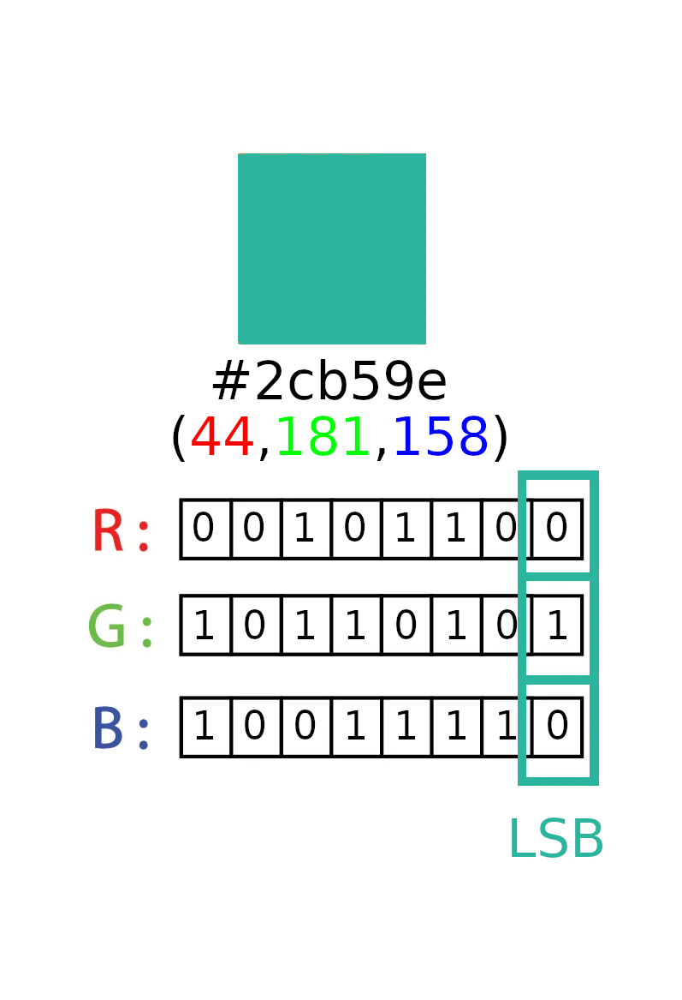

% Stego 101


# whoami?

<br>

::: incremental

- Chandler 
	- aka Throwaway2155 
	- aka d4s3
- Capture All the Flags
- Password Reset Monkey

:::

<br>
<br>

## [ What is Stegonography? ]{.no_title_overflow}

<br>
<br>

::: fragment
*the art or practice of concealing a message, image, or file within another message, image, or file*
<br>
`- Merriam-Webster`
:::

<br>
<br>
<br>


## [ Why care about stego? ]{.no_title_overflow} 

::: notes
File type restrictions are typically used for webservers,

For example if you have a basic Wordpress site or a generic php site with a file upload function that filters out anything thats not a picture you can make a polyglot file that is both an image and a php webshell

The sundown exploit kit used stegonography for both c2 commands and data exfil
:::

<br>
<br>

::: fragment
Stegonography has been used in the past to:
:::

::: incremental
 - bypass file-type restrictions [ ^[[1]](https://bananamafia.dev/post/php-deserialize-cccamp19/)^ ]{.citation}
 - covertly exfiltrate data [ ^[[2]](https://securelist.com/steganography-in-contemporary-cyberattacks/79276/)^ ]{.citation}
 - hide a stage 2 payload [ ^[[3]](https://www.bleepingcomputer.com/news/security/worok-hackers-hide-new-malware-in-pngs-using-steganography/)^ ]{.citation}
:::

<br>
<br>
<br>

# [ Old School Stego ]{.no_title_overflow}

::: notes
Hiding a message inside of another message,

this example bolds the message
:::

::: fragment

<pre><code data-trim data-noescape >
As I write this letter, I am reminded of the enchantment found in everyday moments. <b>H</b>ave you noticed the beauty in a smile shared? <b>A</b>dmire the simplicity of nature's embrace. <b>C</b>herish the laughter that dances through the air. <b>K</b>eep an open heart to life's hidden treasures. <b>T</b>ake a breath and savor the whispers of possibility. <b>H</b>old onto memories that ignite your spirit. <b>E</b>xplore the world with curious eyes. <b>P</b>ause to marvel at the interplay of light and color. <b>L</b>et your imagination paint your reality. <b>A</b>s you journey, embrace growth and self-discovery. <b>N</b>urture your passions, for they fuel your soul. <b>E</b>mbrace <b>T</b>he beauty in the ordinary.
</code></pre>

:::

::: fragment

<pre>
<code>
<b>HACK THE PLANET</b>
</code>
</pre>

:::

<br>
<br>

## [ Other Plaintext Stego]{.no_title_overflow}

::: notes
using whitespace as binary,

space == 0

tab == 1
:::

::: fragment
~~~
 HACK	 THE  PLANET  	
~~~
:::
::: fragment
~~~
\sHACK\t\sTHE\s\sPLANET\s\s\t
~~~
:::
::: fragment
~~~
\s\t\s\s\s\s\s\t
~~~
:::
::: fragment
~~~
01000001
~~~
:::
::: fragment
~~~
A
~~~
:::

## [More Plaintext Stego]{.no_title_overflow}
**Depending on who you ask**

::: notes
This is using an esolang called whitespace<br>
this will print "Hello World"<br>
an in-spec interpreter should ignore any non-whitespace characters<br>
:::

::: fragment
```
S S S T	S S T	S S S L
T	L
S S S S S T	T	S S T	S T	L
T	L
S S S S S T	T	S T	T	S S L
T	L
S S S S S T	T	S T	T	S S L
T	L
S S S S S T	T	S T	T	T	T	L
T	L
S S S S S S T	S S S S S L
T	L
S S S S S T	S T	S T	T	T	L
T	L
S S S S S T	T	S T	T	T	T	L
T	L
S S S S S T	T	T	S S T	S L
T	L
S S S S S T	T	S T	T	S S L
T	L
S S S S S T	T	S S T	S S L
T	L
S S L
L
L
```
:::

::: fragment
```
Hello World
```
:::

# [ Fun with zip files ]{.no_title_overflow}

::: notes
Docx file stuffing demo
```
mkd Whats-a-dinosaur
unzip ../Whats-a-dinosaur.docx
cp ../../chicken.png .
zip ../dino.docx -r * 
unzip -l ../dino.docx
binwalk ../dino.docx
```
Docx file embed in xml comment
```
echo '<!-- ' >> word/document.xml; base64 ../../chicken.png >> word/document.xml; echo '-->' >> word/document.xml
zip ../dino.docx -r * 
strings ../dino.docx
xxd ../dino.docx
vim ../dino.docx
```
:::

<br>
<br>

::: incremental
- .docx, .xlsx, .pptx, etc
- .jar, .war, .ear
- .apk
- .epub
:::

<br>
<br>
<br>

# [ Polyglots ]{.no_title_overflow}
::: notes
There are a ton of different types of polyglot files, mostly because what makes something a polyglot file is ill defined<br><br>
corkami does alot of research on abusing file formats and tries to seperate and catagorize different types of polyglots<br>
```bash
zip hidden_file.zip ../chicken.png
xxd -ps no_chicken.png > polyglot_hex
xxd -ps hidden_file.zip >> polyglot_hex
xxd -ps -r polyglot_hex polyglot.png
```
:::

::: fragment
Different types of polyglots:
:::

::: incremental
 - file concatination
 - header stuffing
 - much more
:::

::: fragment
[https://github.com/corkami/mitra](https://github.com/corkami/mitra)
:::

# [ PNGs ]{.no_title_overflow}
::: notes
Image klepped from the first PoC||GTFO book and was created by Ange Albertini aka corkami
:::

:::: fragment
::: eighty

:::
::::

<br>

## Chunk Stuffing
::: notes
[Specification for chunks](http://www.libpng.org/pub/png/spec/1.2/PNG-Chunks.html)
text chunk format
```
   Title            Short (one line) title or caption for image
   Author           Name of image's creator
   Description      Description of image (possibly long)
   Copyright        Copyright notice
   Creation Time    Time of original image creation
   Software         Software used to create the image
   Disclaimer       Legal disclaimer
   Warning          Warning of nature of content
   Source           Device used to create the image
   Comment          Miscellaneous comment; conversion from
                    GIF comment
```
:::

:::: large_list
::: force_center
::: fragment
**Critical Chunks:**
:::
:::
::: incremental
 - IHDR - Image header, must be the first chunk
 - PLTE - Palette index, only needed if the color byte is set to 0x03
 - IDAT - Image data, where the pixels are stored
 - IEND - Image trailer, data field must be null
:::

::: force_center
::: fragment
**Ancillary Chunks that are potentially stuffable:**
:::
:::
::: incremental
 - gAMA - Gama chunk, 4 byte unsigned int, overwritten by sRGB and iCCP chunks
 - cHRM - Primary chromaticities, also overwritten by sRGB and iCCP chunks
 - tEXt - Text chunk, parsed as metadata
 - zTXt - Compressed text chunk
 - iTXt - UTF8 encoded text chunk
:::
::::

### Chunk Stuffing cont.
**Private Chunks**

::: notes

The first character should be lower case because in-spec parsers will error out an unknown critical chunk<br>
The second character doesn't need to be either since it is advised for parsers to ignore this bit but for edge cases we should set it to lowercase<br>
The third character is reserved for future use and should always be capital<br>
The fourth character is only for editors, if it is safe to copy the chunk will be copied to the new image
<br>
<br>

My chunk will be called `stEg` so it will be parsed as an ancillary, private, and safe to copy chunk

:::

::: fragment
+---------------+---------------+--------------------+--------------------+--------------------+
|               | First letter  | Second letter      | Third Letter       | Fourth Letter      |
+===============+===============+====================+====================+====================+
| Uppercase     | Critical      | Public Chunk       | Reserved           | Not Safe to Copy   |
|               | Chunk         |                    |                    |                    |
+---------------+---------------+--------------------+--------------------+--------------------+
| Lowercase     | Ancillary     | Private Chunk      | N/A                |  Safe to Copy      |
|               | Chunk         |                    |                    |                    |
+---------------+---------------+--------------------+--------------------+--------------------+
:::

::: fragment
```
stEg
```
:::

## Least significant bit
::: notes
lsb is the most difficult to discover<br>
my demo is a simple script that loops through all the pixels to embed data in serial<br>
I've seen patterns used in ctfs such as spirals and checkerdboards<br>
each pixel can hold three bit so the demo image being 50x50 can hold 7500 bits<br>
my demo script will only work with color type 2 (rgb 8bit) and uncompressed png files
:::

:::: fragment
::: fifty

:::
::::

# Fin
**Any Questions?**
<br>
Link to Slides
<br>

::: bigger_img

:::
